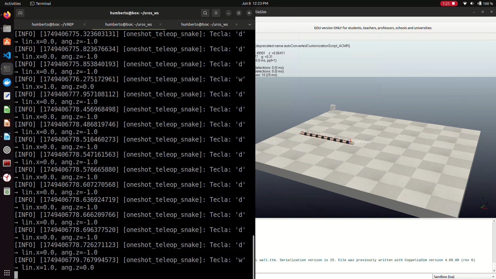

# SnakeTeleop

##### Teleoperating the ACM-R5 in CoppeliaSim using ROS2

## Repository Contents

- **snake.lua**  
  A CoppeliaSim child script that subscribes to `/cmd_vel` (geometry_msgs/Twist) and drives the snake’s joint oscillation and turning impulses.

- **node.py**  
  A ROS 2 Python node (`rclpy`) that reads single-key teleop commands (W/S/A/D) from the keyboard and publishes one-shot `/cmd_vel` messages.

## Prerequisites

- **CoppeliaSim** with the **simExtROS2** plugin enabled  
- **ROS 2** (e.g. Foxy, Galactic or later) installed and sourced  
- **Python 3** with `rclpy` and `geometry_msgs`  

## Gallery

